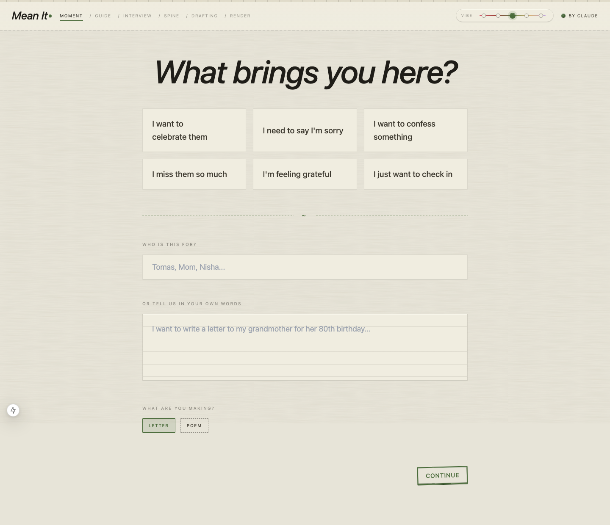
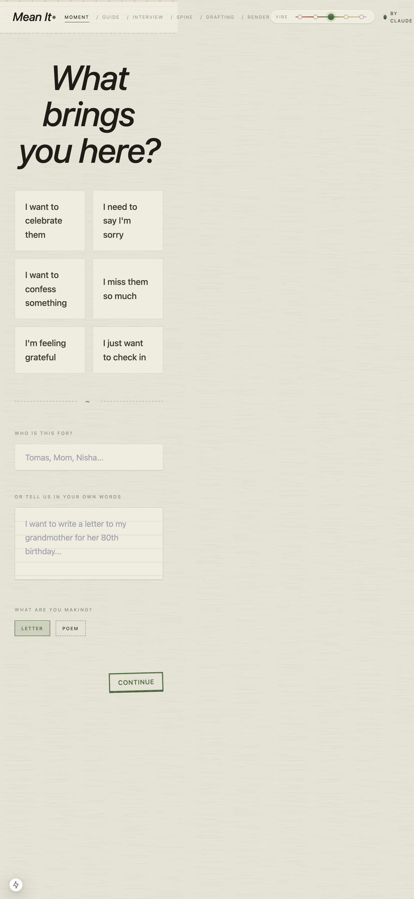
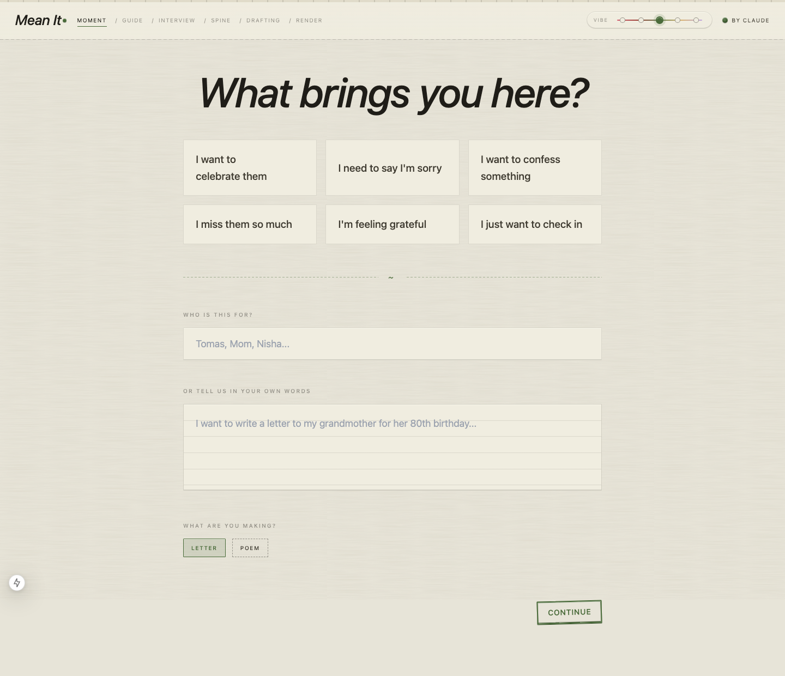
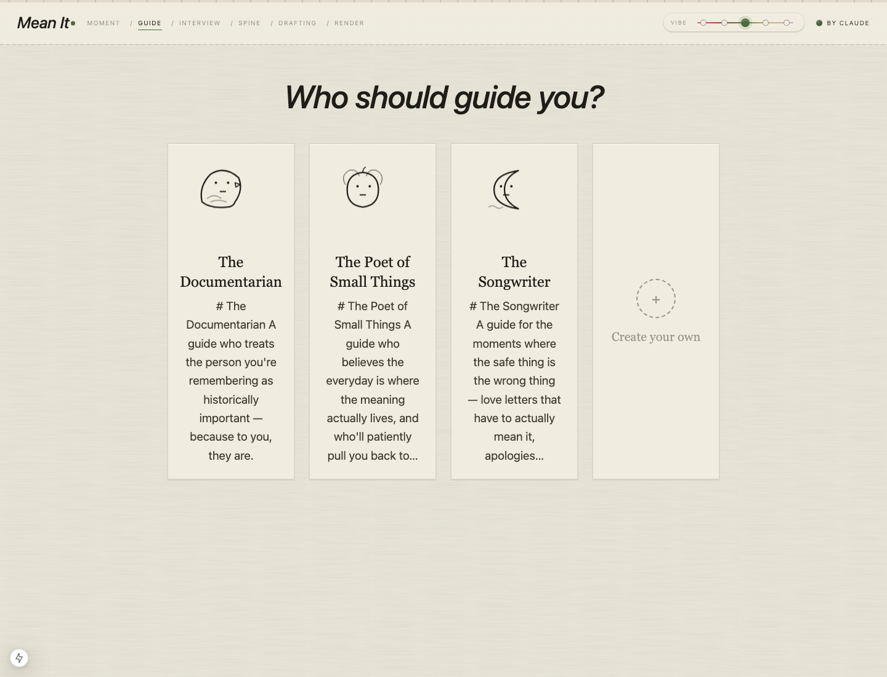
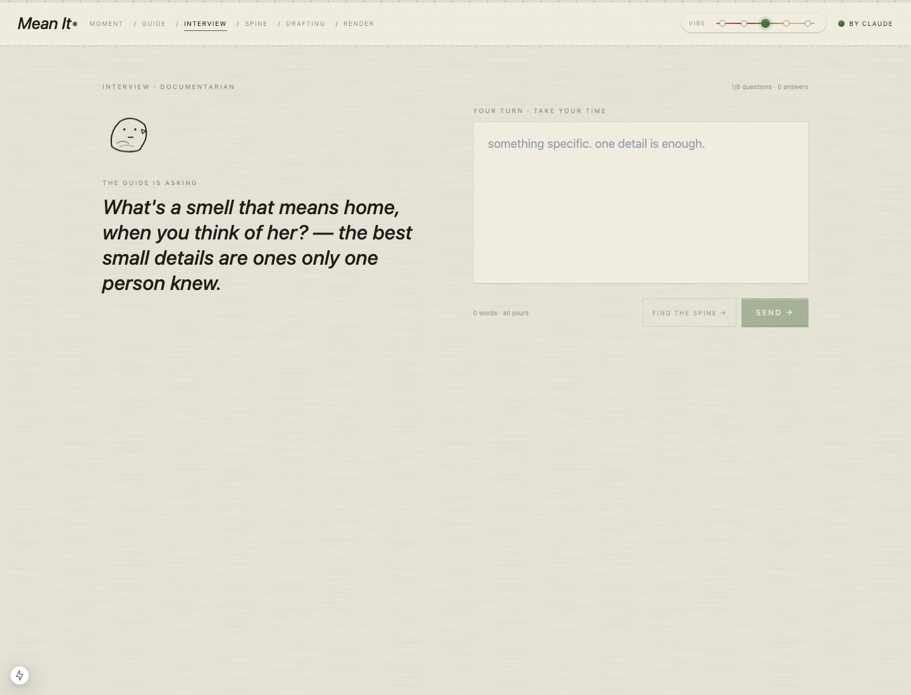
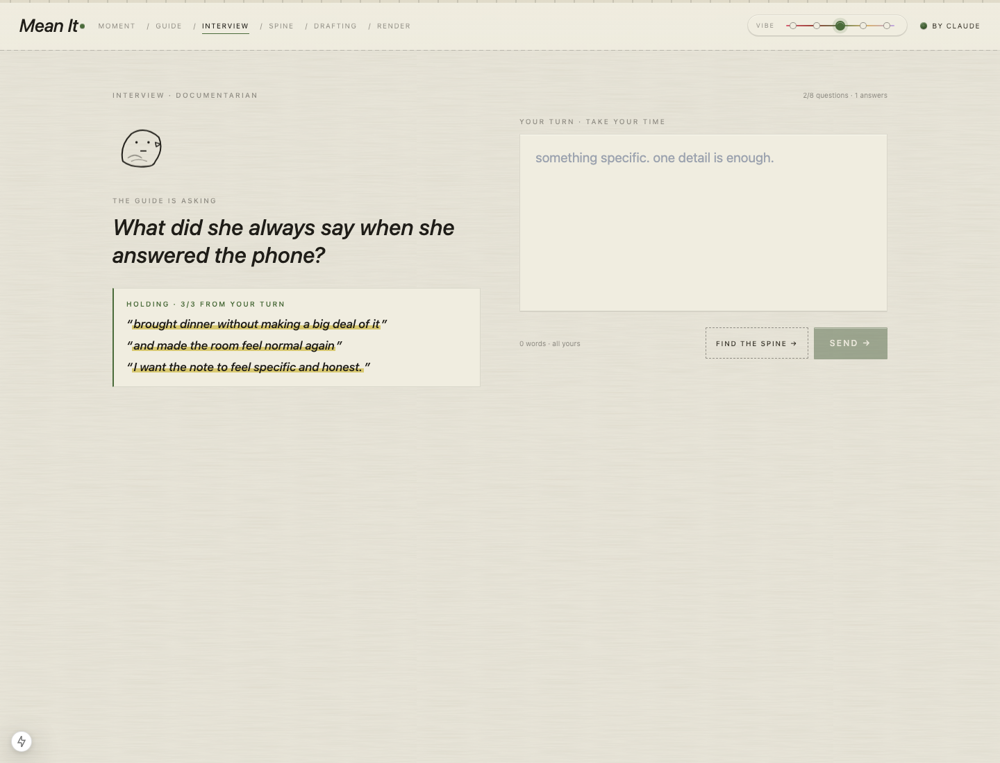
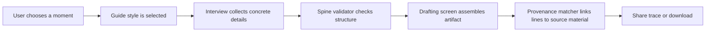
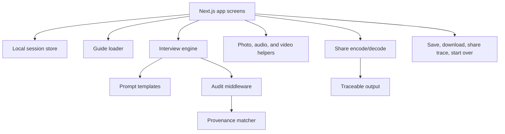

# Mean It

Guided writing companion that interviews the user, preserves source material, and produces a provenance trace so the final artifact can be traced back to the user's own words.

Mean It is a Next.js app for human-centered writing workflows. Instead of jumping straight to generation, it guides the user through choosing a moment, picking a guide style, interviewing for detail, assembling a spine, rendering the final piece, and sharing a trace of how each line was grounded.

## Contents

- [At A Glance](#at-a-glance)
- [Screenshot Gallery](#screenshot-gallery)
- [Writing Workflow](#writing-workflow)
- [Architecture](#architecture)
- [Feature Map](#feature-map)
- [Tech Stack](#tech-stack)
- [Repository Map](#repository-map)
- [Run Locally](#run-locally)
- [Verification](#verification)
- [Configuration](#configuration)
- [Status](#status)
- [License](#license)

## At A Glance

| Area | Details |
|---|---|
| Product | Guided writing and provenance workspace |
| Users | People turning a personal moment into a grounded written artifact |
| Core value | Interview first, draft later, and keep a shareable trace of source-to-output grounding |
| Frontend | Next.js, React, Tailwind |
| Core modules | guide loader, interview middleware, spine validation, provenance matching, share encoding |
| Tests | Vitest suite |
| Design docs | `DESIGN.md`, `docs/techstack.md`, wireframes and high-fidelity design files |

## Screenshot Gallery

| Image | Caption |
|---|---|
|  | Desktop home screen with full writing workspace and guidance flow entry points visible. |
|  | Mobile layout version showing responsive adaptation of the writing session cards and nav flow. |
|  | Moment intake screen where the user chooses emotional intent, recipient, and artifact type. |
|  | Guide selection step with distinct writing guide personas and custom guide entry point. |
|  | Interview screen showing the active guide question, preserved source phrase area, and answer composer. |
|  | Answered interview state with user source material captured for later spine and provenance steps. |

## Writing Workflow



## Architecture



## Feature Map

| Feature | Evidence in repo |
|---|---|
| App shell | `components/App.tsx`, `components/Chrome.tsx` |
| Moment picker | `components/screens/PickMoment.tsx` |
| Guide selection | `components/screens/GuidePicker.tsx`, `lib/guides/` |
| Interview flow | `components/screens/Interview.tsx`, `lib/interview/` |
| Spine validation | `components/screens/Spine.tsx`, `lib/spine/validate.ts` |
| Render/download | `components/screens/Render.tsx`, `components/modals/Download.tsx` |
| Provenance | `lib/provenance/match.ts`, `components/modals/ShareTrace.tsx` |
| Media helpers | `lib/audio/`, `lib/video/`, `lib/images/` |

## Tech Stack

| Layer | Technology |
|---|---|
| App | Next.js, React, TypeScript |
| Styling | Tailwind CSS |
| Testing | Vitest |
| State | Local store modules |
| Media | Audio transcription/TTS helpers, video curation helpers |
| Docs | Wireframes, design docs, tech stack notes |

## Repository Map

```text
components/   Screens, modals, mascots, app chrome
lib/          Interview, provenance, media, guides, sharing, env
prompts/      System and guide prompt templates
docs/         Design docs, wireframes, screenshots
```

## Run Locally

```bash
cp .env.example .env.local
npm install
npm run dev
```

Open `http://localhost:3000`.

## Verification

Local results from the screenshot/docs pass:

| Command | Result |
|---|---|
| `npm run typecheck` | Passed |
| `npm test` | Passed, 254 tests |

## Configuration

Keep provider keys in `.env.local`, which is gitignored.

```bash
ANTHROPIC_API_KEY=
OPENAI_API_KEY=
```

## Status

The project has a strong product thesis, real screenshots, passing tests, and good design docs. The next step is a short demo video or animated walkthrough showing the full interview-to-trace workflow.

## License

MIT. See [LICENSE](LICENSE).
